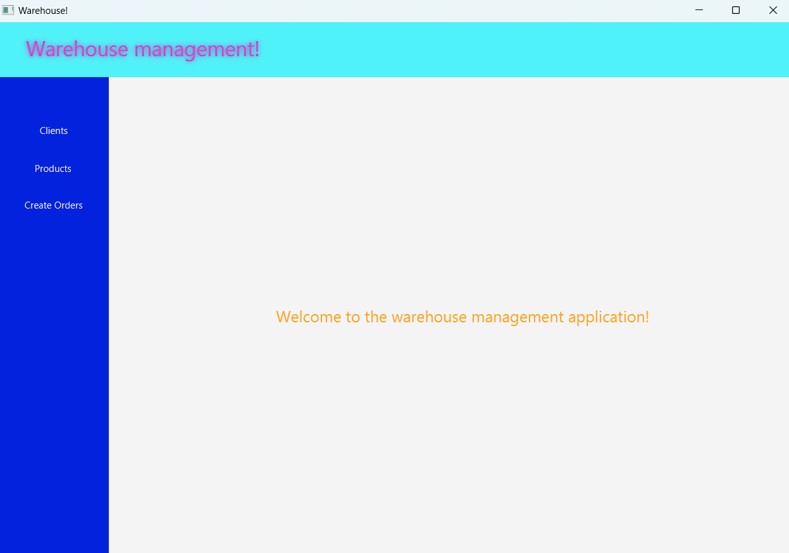
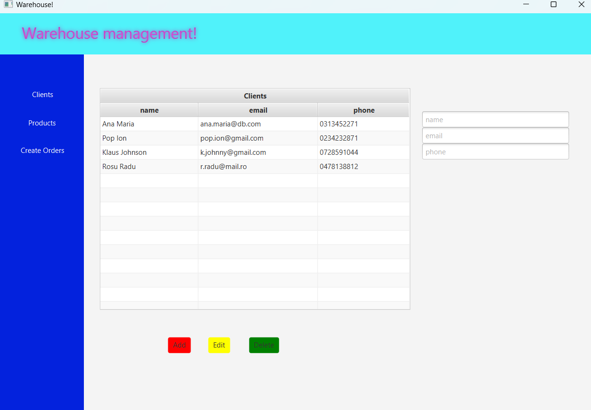
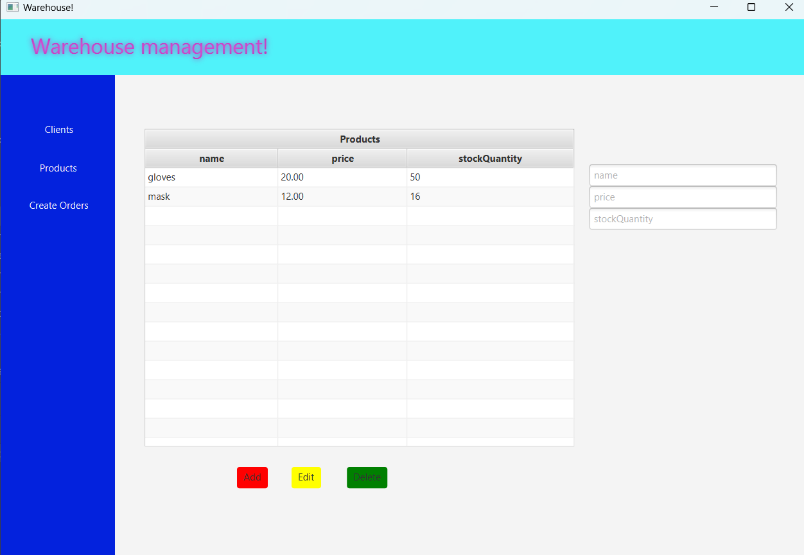
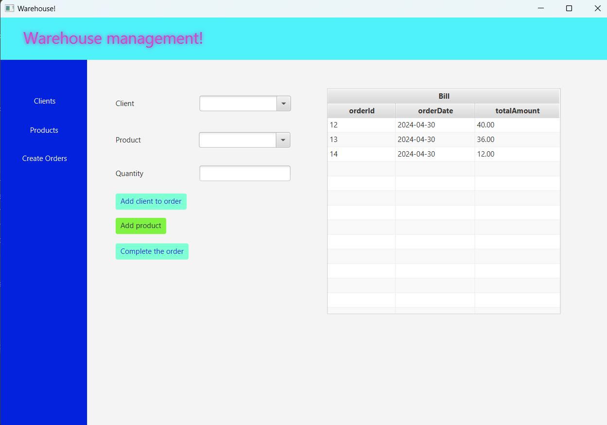

# Warehouse Management Application

This project is an Orders Management application designed to process client orders for a warehouse. It utilizes a layered architecture pattern and relational databases to store data related to clients, products, and orders.

## Features

- Add, edit, and delete clients
- View all clients in a table
- Add, edit, and delete products
- View all products in a table
- Create product orders by selecting existing products and clients, and specifying the quantity
- Display under-stock message if there are not enough products for an order
- Decrement product stock after finalizing an order

## Architecture

The application is designed according to the layered architecture pattern, consisting of the following layers:
- Model classes: Represent the data models of the application
- Business Logic classes: Contain the application logic
- Presentation classes: GUI related classes
- Data access classes: Contain the access to the database

## Graphical User Interface

The GUI includes the following windows:
- Client operations window: Add new client, edit client, delete client, view all clients in a table

- Product operations window: Add new product, edit product, delete product, view all products in a table

- Order creation window: Select existing product, select existing client, insert desired quantity, and create a valid order. Displays under-stock message if necessary.

## Reflection Techniques

Reflection techniques are used to:
- Generate table headers dynamically by extracting object properties
- Populate tables with values from object lists
- Create a generic class for accessing the database, including methods for creating, editing, deleting, and finding objects. Queries are generated dynamically through reflection.

